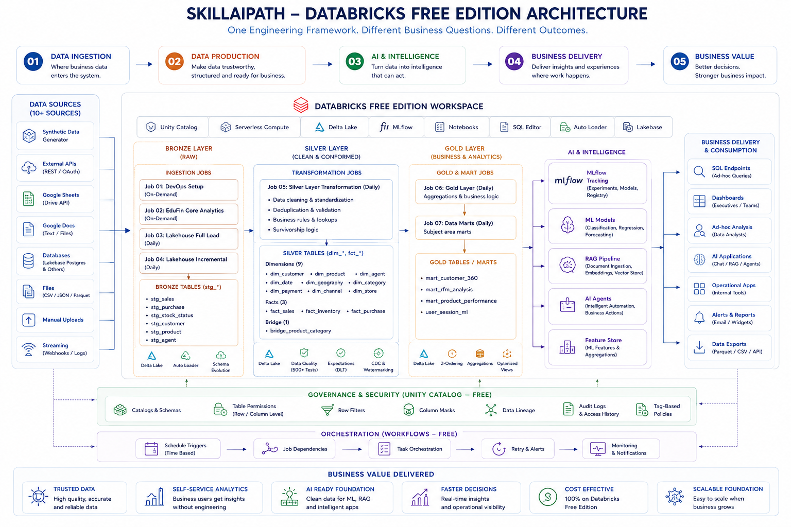

<p align="center">
  
</p>

# SkillAIPath

### A Practical, End-to-End Data Engineering, AI & BI Ecosystem

A hands-on learning and production platform covering analytics, orchestration, data engineering, business intelligence, observability, and intelligent applications.

---

## About

**SkillAIPath** is a structured four-month ecosystem demonstrating the modern data lifecycle — from analytics foundations and platform orchestration to production data engineering, BI, observability, and live applications.

Each module is designed to contribute to a complete production-oriented Data Engineering portfolio.

---

## Ecosystem Overview

| **Module** | **Focus** | **Key Areas** |
|---|---|---|
| **0. Core Analytics** | Foundational Analytics | SQL, Business Analysis, EduFin Case Study |
| **1. Canvas** | Platform Foundation | Setup, Orchestration, Apps, External Data |
| **2. Data Production** | Production Data Engineering | Medallion, Unity Catalog, dbt, Quality, Monitoring |
| **3. Business Intelligence** | BI & Observability | Monitoring, Dashboards, Streamlit Applications |

---

# 0. Core Analytics

`0_Core_Analytics/`

A guided analytics case study built around **EduFin**, a fictional education lender, designed to practice real-world analytical problem solving and business decision-making.

### What's Included

| **Area** | **Coverage** |
|---|---|
| **SQL & Analytics** | SQL Fundamentals · JOINs · Aggregations · Filtering · CTEs · Window Functions |
| **Risk & Portfolio Analysis** | Portfolio Health · Customer Risk · Time Analysis · Cost Tracking |
| **Learning & Workflow** | `00_Start_Here.md` · Structured Onboarding · Business-Focused Analytical Workflows |

### Technology


---

# 1. Canvas

`1_Canvas/`

The platform foundation layer used for environment setup, orchestration, reusable application patterns, architecture documentation, and external data ingestion.

### What's Included

| **Area** | **Coverage** |
|---|---|
| **Platform Foundation** | Environment Configuration · Synthetic Data Generation · Architecture Diagrams |
| **Pipeline & Orchestration** | Full-Load Pipeline Orchestration · Incremental Pipeline Orchestration |
| **Application Patterns** | Reusable Application Templates · Realtime Monitoring Patterns · Executive Reporting |
| **Business Workflows** | Supply Chain API Patterns · Automated Reorder Workflows · Gold Analytics Dashboard Patterns |
| **External Data** | External Data Ingestion · Supplier Data · Weather Data · Exchange-Rate Data · Logistics Data |

### Application Templates

| **Application / Pattern** | **Included** |
|---|:---:|
| Realtime Monitoring | ✓ |
| Predictive Analytics | ✓ |
| Executive Reporting | ✓ |
| Supply Chain API | ✓ |
| Automated Reorder | ✓ |
| Gold Analytics Dashboard | ✓ |
| Reference Application Patterns | ✓ |
| Orchestration Applications | ✓ |

Several applications are containerized using Docker.

### Technology


---

# 2. Data Production

`2_Data_Production/`

A production-oriented data platform built around the **Medallion Architecture**, with governance, transformation, data quality, synchronization, and operational monitoring.

### What's Included

| **Area** | **Coverage** |
|---|---|
| **Unity Catalog Governance** | Catalog & Schema Management · Iceberg / UniForm Setup · Governance Patterns · Secrets Management · PII Masking · Access-Control Patterns |
| **Medallion Architecture** | Bronze Ingestion · Silver Transformations · Gold Data Products · Dimension Modeling · Fact Modeling · Streaming CDC · Gold-Layer Aggregations · Analytical Views |
| **dbt Project — `sap_dw`** | Staging Models · Intermediate Models · Mart Models · Macros · Seeds · Tests · Transformation Workflows |
| **Data Quality & Operations** | Quality Gates · Validation Framework · Data Validation · Optimization Routines · Automated Checks · Pytest-Based Testing |
| **OLTP ↔ OLAP Synchronization** | REST API Ingestion · OAuth Authentication · Paginated API Extraction · OLTP-to-OLAP Synchronization · Incremental Synchronization Patterns |
| **Monitoring & Governance** | Troubleshooting Runbooks · Logging · Alerting · Audit Trail Queries · Time-Travel Recovery · Data Profiling · Data Drift Detection · Operational Monitoring |

### Technology


---

# 3. Business Intelligence

`3_Business_Intelligence/`

The business intelligence, observability, monitoring, and application layer of the ecosystem.

### Platform Observability

| **Area** | **Coverage** |
|---|---|
| **Monitoring & Metrics** | Cost Tracking · Custom Metrics · Data Quality · Lakehouse Monitoring · Performance Monitoring |
| **Operations** | Incident Management · Operational Runbooks |

### BI Production

| **Area** | **Coverage** |
|---|---|
| **Business Intelligence** | Dashboard Setup · BI Data Operations · Analytical Reporting · Production-Oriented Dashboard Workflows |

### Live Applications

| **Application** | **Purpose** |
|---|---|
| **PR Reviewer** | Business-facing review workflow |
| **Team Operations Center** | Business-facing operational application |

These Streamlit applications expose data workflows through usable business-facing interfaces.

### Technology


---

# Portfolio Highlights

| **Deliverable** | **Target** |
|---|---:|
| **Business SQL Investigations** | 30+ |
| **Documented Tables** | 30 |
| **Production Dashboards** | 10 |
| **Architecture Diagrams** | End-to-End |
| **GitHub Portfolio** | Production-Ready |
| **Demo Presentation** | 5 Minutes |

---

# Technology Stack

| **Category** | **Technologies** |
|---|---|
| **Languages** |   |
| **Data Analysis** |    |
| **Data Engineering** |     |
| **BI & Visualization** |    |
| **Application & APIs** |   |
| **Infrastructure & Testing** |     |
| **Development** |  |

---

# Repository Structure

```text
SkillAIPath/
│
├── 0_Core_Analytics/
│   ├── SQL Fundamentals
│   ├── EduFin Analysis
│   └── 00_Start_Here.md
│
├── 1_Canvas/
│   ├── Setup
│   ├── Data Generation
│   ├── Orchestration
│   ├── App Templates
│   ├── External Sources
│   └── Architecture Diagrams
│
├── 2_Data_Production/
│   ├── Unity Catalog
│   ├── Medallion Architecture
│   ├── dbt
│   ├── Data Quality
│   ├── OLTP-OLAP Sync
│   └── Monitoring & Governance
│
├── 3_Business_Intelligence/
│   ├── Platform Observability
│   ├── BI Production
│   └── Live Streamlit Apps
│
└── README.md
